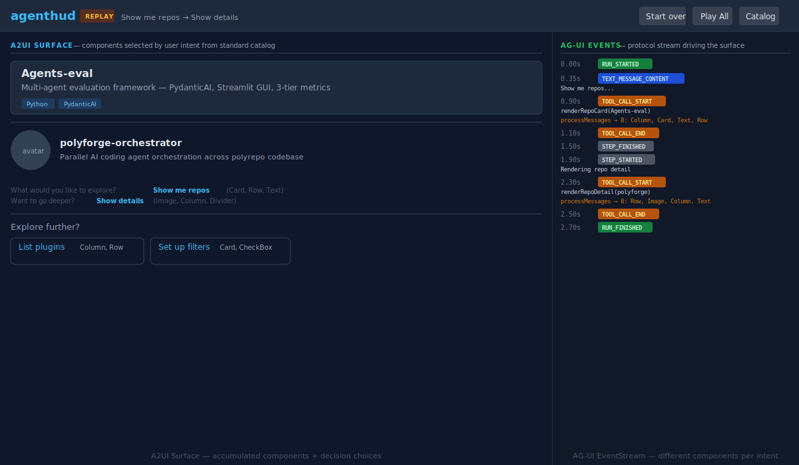

# agenthud-agui-a2ui

[](LICENSE)

[](https://github.com/qte77/agenthud-agui-a2ui/actions/workflows/codeql.yaml)
[](https://www.codefactor.io/repository/github/qte77/agenthud-agui-a2ui)
[](https://github.com/qte77/agenthud-agui-a2ui/actions/workflows/links-fail-fast.yaml)
[](https://github.com/qte77/agenthud-agui-a2ui/actions/workflows/dependabot/dependabot-updates)

> **Prototype** — This is a feasibility prototype, not a production application.

AG-UI event replay + A2UI component rendering in a static Vite/React app.

Demonstrates how different user intents produce different UI layouts from the same A2UI standard catalog — without executing arbitrary code. Users navigate a decision tree; each choice plays a different segment with distinct component compositions that stack on the surface.



## What it shows

- **Decision tree**: Branching choices drive which A2UI components render. Each path uses different components from the same catalog.
- **A2UI Surface** (left panel): Components accumulate as users navigate deeper. Rendered from declarative JSON via `@a2ui/react`.
- **AG-UI EventStream** (right panel): Protocol events streamed with timing, showing which components each tool call produces.
- **Decision history**: Breadcrumb trail of choices + prompt/hint per decision.
- **Catalog Viewer**: Modal listing all 18 A2UI standard components with first-party links.
- **Play All**: Runs the full recording linearly.

## Decision tree

```text
root (3 choices)
├─ Show me repos → Card, Row, Text
│  ├─ Show details → Image, Column, Divider
│  ├─ List plugins → Column, Row, Text
│  └─ Browse categories → Tabs
├─ Browse by category → Tabs
│  ├─ Show repo details → Image, Column, Divider
│  ├─ List plugins → Column, Row
│  └─ Set up filters → CheckBox
└─ Filter repos → Card, CheckBox
   ├─ Adjust range → Slider
   │  └─ Apply filters → Button
   │     └─ Show results → Card, Text, Divider
   └─ Apply now → Button
      └─ Show results → Card, Text, Divider
```

10 tree nodes, no dead ends. Every leaf connects back to other branches.

## Repos shown

- Agents-eval — Multi-agent evaluation framework
- RAPID-spec-forge — Requirements-to-Agent Pipeline
- ai-agents-research — Claude Code internals research
- polyforge-orchestrator — Parallel agent orchestration
- claude-code-plugins — Plugin marketplace (26 plugins)

## Components used (10 of 18)

Card, Column, Row, Text, Image, Divider, Tabs, CheckBox, Slider, Button + results view.

## Stack

| Package | Version | Purpose |
|---|---|---|
| `@a2ui/react` | 0.8.0 | Google's A2UI React renderer |
| `@ag-ui/core` | 0.0.49 | AG-UI event type definitions |
| `react` | 19 | UI framework |
| `vite` | 7 | Build + dev server |
| `tailwindcss` | 4 | Styling (Vite plugin, no config file) |
| `typescript` | 5.8 | Type checking |

## Run

```bash
npm install
npm run dev
```bash

Choose a path from the decision tree or press **Play All** for the full sequence. Click **Catalog** to view the A2UI component library.

## Build

```bash
npm run build
npx vite preview
```

Build output in `dist/` is deployable to GitHub Pages with base path `/agenthud-agui-a2ui/`.

## Modes

| Mode | Status | Description |
|---|---|---|
| **Replay** | Current | Pre-baked AG-UI events with decision tree navigation |
| GitHub Models | Planned | Live agent via GitHub Models API (OpenAI-compatible) |
| BYOK | Planned | Visitor provides their own API key |

## References

- [A2UI Specification](https://a2ui.org/specification/v0.9-a2ui/)
- [A2UI React Renderer](https://github.com/google/A2UI/tree/main/renderers/react)
- [AG-UI Protocol](https://docs.ag-ui.com/introduction)
- [AG-UI GitHub](https://github.com/ag-ui-protocol/ag-ui)
