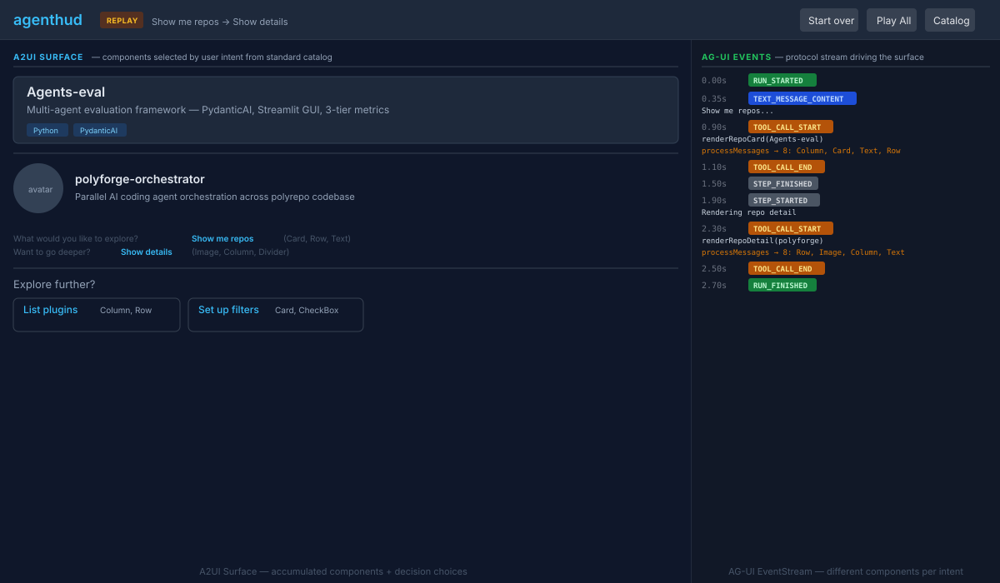

# agenthud-agui-a2ui

[](LICENSE)

[](https://github.com/qte77/agenthud-agui-a2ui/actions/workflows/codeql.yaml)
[](https://www.codefactor.io/repository/github/qte77/agenthud-agui-a2ui)
[](https://github.com/qte77/agenthud-agui-a2ui/actions/workflows/lint-md-links.yml)
[](https://github.com/qte77/agenthud-agui-a2ui/actions/workflows/dependabot/dependabot-updates)

> **Prototype** — This is a feasibility prototype, not a production application.

AG-UI event replay + A2UI component rendering in a static Vite/React app.

Demonstrates how different user intents produce different UI layouts from the same A2UI standard catalog — without executing arbitrary code. Users navigate a decision tree; each choice plays a different segment with distinct component compositions that stack on the surface.



## What it shows

- **Decision tree** drives which A2UI components render — each path uses a different mix from the same catalog.
- **A2UI Surface** (left panel): declarative components accumulate as you navigate, rendered via `@a2ui/react`.
- **AG-UI EventStream** (right panel): protocol events with timing, showing which components each tool call produces.
- **Catalog Viewer**: modal listing all 18 A2UI standard components with first-party links.
- **Theming**: qte77 **EyeRest** brand palette (zero-blue, warm amber) with a light/dark/system toggle (◐ / ○ / ●).
- **Live mode (BYOK)**: switch **Demo → Live** to drive the same surface with a real LLM. Bring an OpenAI-compatible key; the agent's `render_ui` tool streams AG-UI events that render validated A2UI — no server, 100% in-browser.

> Full user stories and acceptance criteria: [docs/UserStory.md](docs/UserStory.md).

## Decision tree

```text
root (3 choices)
├─ Show me repos → Card, Row, Text
│  ├─ Show details → Image, Column, Divider
│  ├─ List plugins → Column, Row, Text
│  └─ Browse categories → Tabs
├─ Browse by category → Tabs
│  ├─ Show repo details → Image, Column, Divider
│  ├─ List plugins → Column, Row
│  └─ Set up filters → CheckBox
└─ Filter repos → Card, CheckBox
   ├─ Adjust range → Slider
   │  └─ Apply filters → Button
   │     └─ Show results → Card, Text, Divider
   └─ Apply now → Button
      └─ Show results → Card, Text, Divider
```

10 tree nodes, no dead ends. Every leaf connects back to other branches.

## Repos shown

- Agents-eval — Multi-agent evaluation framework
- RAPID-spec-forge — Requirements-to-Agent Pipeline
- ai-agents-research — Claude Code internals research
- polyforge-orchestrator — Parallel agent orchestration
- claude-code-plugins — Plugin marketplace (26 plugins)

## Components used (10 of 18)

Card, Column, Row, Text, Image, Divider, Tabs, CheckBox, Slider, Button + results view.

## Stack

| Package | Purpose |
|---|---|
| `@a2ui/react` | Google's A2UI React renderer |
| `@ag-ui/core` | AG-UI event type definitions |
| `zod` | Validated A2UI + recording contract (also the live agent's `render_ui` tool schema) |
| `ai` + `@ai-sdk/openai` | Vercel AI SDK — the in-browser BYOK live agent (Live mode, code-split) |
| `react` | UI framework |
| `vite` | Build + dev server |
| `tailwindcss` | Styling + EyeRest brand theme tokens (no config file) |
| `@fontsource/*` | Self-hosted brand fonts (Inter, JetBrains Mono) |
| `typescript` | Type checking |

## Run

```bash
npm install
npm run dev
```

Choose a path from the decision tree or press **Play All** for the full sequence. Click **Catalog** to view the A2UI component library.

For **Live** mode, toggle **Demo → Live** in the header and supply an OpenAI-compatible base URL + API key + model id (e.g. an OpenRouter key). Credentials live in `sessionStorage` only and are never persisted; the demo needs no key.

## Build

```bash
npm run build
npx vite preview
```

Build output in `dist/` is deployable to GitHub Pages with base path `/agenthud-agui-a2ui/`.

## Modes

See [ADR-0001](docs/decisions/0001-agent-runtime-stack.md) for the rationale.

| Mode | Status | Notes |
|---|---|---|
| **Demo** (offline replay) | Current | Pre-baked AG-UI events + decision-tree navigation |
| **Live (BYOK)** | Current | In-browser Vercel AI SDK agent; visitor-supplied OpenAI-compatible key (sessionStorage only); `render_ui` tool → validated A2UI |
| Keyless worker | Deferred — [#52](https://github.com/qte77/agenthud-agui-a2ui/issues/52) | Optional edge worker; GitHub Models has no browser CORS |

## References

- [Documentation index](docs/README.md) — protocols, testing, user stories, ADRs
- [Contributing](.github/CONTRIBUTING.md) — dev setup, tests, PR workflow
- [A2UI Specification](https://a2ui.org/specification/v0.9-a2ui/)
- [A2UI React Renderer](https://github.com/google/A2UI/tree/main/renderers/react)
- [AG-UI Protocol](https://docs.ag-ui.com/introduction)
- [AG-UI GitHub](https://github.com/ag-ui-protocol/ag-ui)

## License

[Apache-2.0](LICENSE).
