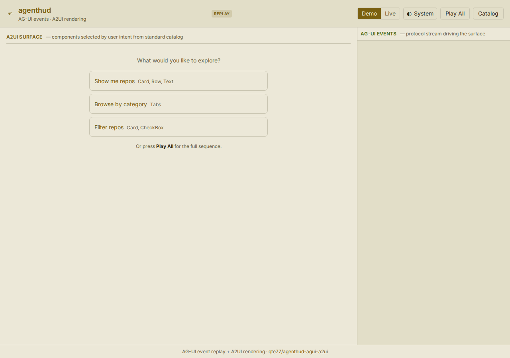

# agenthud-agui-a2ui

> AG-UI event replay + A2UI component rendering in a static Vite/React app — a feasibility
> prototype for developers exploring how an agent composes safe, declarative UI from a
> standard catalog.

[](LICENSE)
[](CHANGELOG.md)
[](https://github.com/qte77/agenthud-agui-a2ui/actions/workflows/ci.yml)
[](https://github.com/qte77/agenthud-agui-a2ui/actions/workflows/codeql.yaml)
[](https://www.codefactor.io/repository/github/qte77/agenthud-agui-a2ui)
[](https://github.com/qte77/agenthud-agui-a2ui/actions/workflows/lint-md-links.yml)
[](https://github.com/qte77/agenthud-agui-a2ui/actions/workflows/dependabot/dependabot-updates)

## What

agenthud demonstrates the **AG-UI + A2UI** loop end to end: an agent composes UI by
referencing components from a fixed catalog — no arbitrary code runs on the client —
streamed as AG-UI protocol events and rendered by `@a2ui/react` on a Vite/React surface.
What you get: a **Demo** tier that replays pre-baked AG-UI events down a branching decision
tree, where each path renders a different component mix from the same catalog (with a live
event stream beside the surface) plus a Catalog Viewer of all 18 A2UI components; the qte77
**EyeRest** theme with a light/dark/system toggle; and a **Live (BYOK)** tier that swaps the
replay for a real LLM in the browser — its `render_ui` tool (zod-validated) emits the same
AG-UI events from your own OpenAI-compatible key.

<details>
<summary>Screenshot — Demo mode</summary>

<picture>
  <source media="(prefers-color-scheme: dark)" srcset="assets/screenshot-dark.png" />
  
</picture>

</details>

## How

**Explore** — open the [live demo](https://qte77.github.io/agenthud-agui-a2ui/) (zero setup),
or run it locally:

```bash
cd ui
npm install
npm run dev
```

Pick a path from the decision tree or press **Play All**; click **Catalog** to browse the
A2UI components.

**Live (BYOK)** — toggle **Demo → Live** in the header and supply an OpenAI-compatible base
URL + API key + model id (e.g. an OpenRouter key). Credentials stay in `sessionStorage`
only; the demo needs no key. Rationale: [ADR-0001](docs/decisions/0001-agent-runtime-stack.md).

**Build & develop** — the local loop:

```bash
cd ui
npm run build      # tsc -b + vite build -> dist/ (deployable to GitHub Pages)
npm run typecheck  # tsc -b --noEmit
npm run lint       # eslint
npm test           # vitest
```

## Why

Agents increasingly need to *show* things, not just say them — but server-rendered generative
UI couples the agent to a frontend framework and risks executing arbitrary code on the client.
**A2UI** keeps it safe: the agent only references components from a known catalog (no code
runs), and **AG-UI** streams those choices as protocol events. agenthud is the smallest
end-to-end demonstration of that loop — the same standard catalog producing different layouts
per user intent — from pre-baked replay to a live BYOK agent. More in
[docs/UserStory.md](docs/UserStory.md) and [docs/protocols.md](docs/protocols.md).

## Refs

A static Vite/React app: pre-baked recordings — or a live Vercel AI SDK agent — emit AG-UI
events through one `applyA2UIEvent` seam into the `@a2ui/react` surface; `zod` validates the
A2UI payloads on both sides.

- [Documentation index](docs/README.md) — protocols, testing, user stories, ADRs
- [ADR-0001](docs/decisions/0001-agent-runtime-stack.md) — TS-only agent runtime (vs Pydantic)
- [Contributing](.github/CONTRIBUTING.md) — dev setup, tests, PR workflow
- [A2UI](https://a2ui.org/specification/v0.9-a2ui/) · [AG-UI](https://docs.ag-ui.com/introduction)

## License

Apache-2.0 — see [LICENSE](LICENSE). Bundled brand fonts (Inter, JetBrains Mono) are under the
SIL OFL 1.1.
